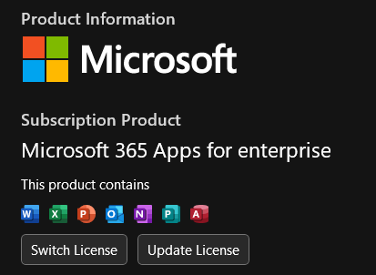

<!--markdown tutorial-->
Amartya Swapnil Prionta.
---

 <br>


this is the third line.


<br>

#  heading
## heading
### heading
#### heading
##### heading
###### heading

<br>


<p> I am a student. I studied my hole life in Hatia. I want to become a BCS. </P>
<I>I can write italic</i> <br>
<b>I can write italic</b> <br>
<del>cross line</del>  <br>

_Italic_ 
__bold__
~~Delete~~

 <br>

### Inline

This is `inline`  
`<h1>Bangladesh</h>`  


```html 
<html>
<head>
</head>
<body>
</body>
</html>
```

<br>

### Ordered list
1. Item1
2. Item2
    1. red
    2. blue
3. Item3
4. Item4

<br>

### Unordered list
- Item1
- Item2
     - red
     - black
- Item3
- Item4

<br> 

### Task List
- [] Incomplete
- [x] Complete 

<br>

### Automatic Link
https://www.youtube.com/

<br>

### Disable Link
`https://www.youtube.com/`

<br>

### Markdown Link
[Youtube](https://www.youtube.com/)

<br>

<!--all link is here-->
[Youtube](https://www.youtube.com/)

<br>


### Markdown Link Organize
[Youtube](youtubelink)


<!--all links are here-->
[youtubelink]: https://www.youtube.com/


<br>

### Image Syntax




<br>

### Emoji
❤️
Just copy paste

<br>


### Table syntax

|Name|Email|
|----|-----|
|Swapnil| Amartya.Archive@gmail.com |
|Disha|t7.papia@gmail.com|
|vanu|saimun.udoy@gmail.com|